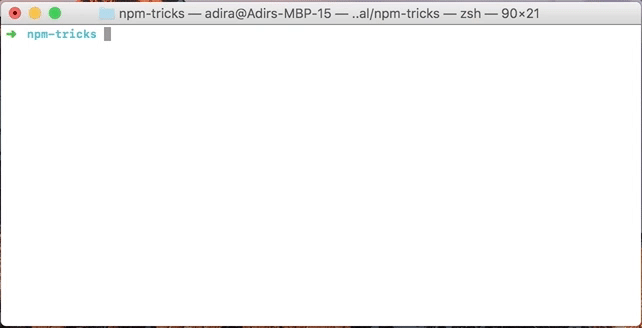
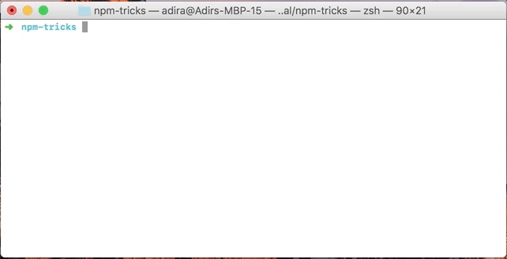
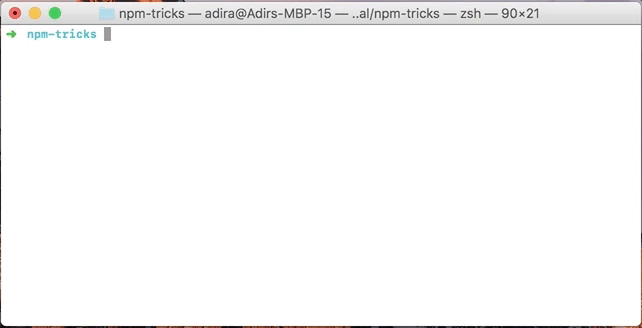
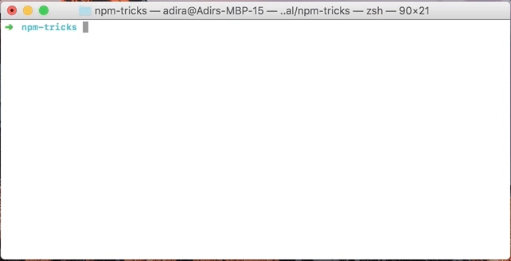
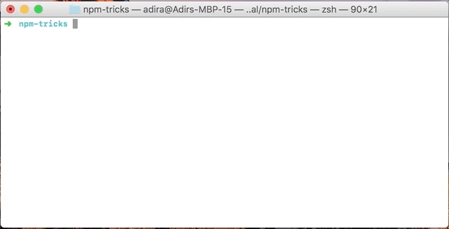
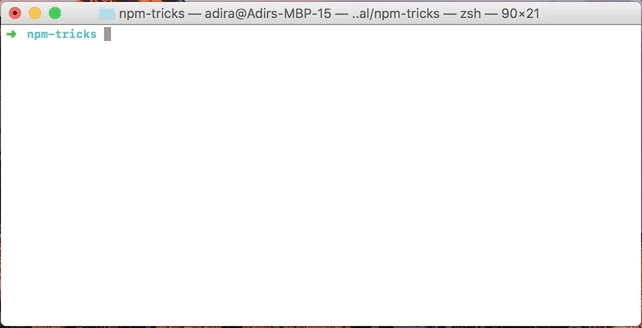

# NPM команды

## Базовые сокращения
Сначала вспомним самые известные сокращения для установки:

- установить пакет: `npm install pkg`, сокращение: `npm i pkg`.
- установить пакет глобально: `npm i --global pkg`, сокращение: `npm i -g pkg`.
- установить пакет только для использования в разработке (devDependency): `npm i --save-dev pkg`, сокращение: `npm i -D pkg`.

Другие сокращения можно посмотреть на официальном сайте.

## Инициализация нового пакета

Первое действие при создании нового пакета — `npm init`:

  

Если вопросы кажутся вам лишними и вы хотите их проскочить, используйте `npm init -y` или `npm init -f`:

 

## Тестирование

Часто используемую команду `npm test` можно заменить на `npm t`, она делает то же самое:

## Доступные скрипты

При работе над новым проектом вы, скорее всего, интересуетесь, что вообще можно запустить в его рамках. Можно открыть файл `package.json` и проверить секцию `scripts`:

Но список доступных скриптов можно получить и через `npm run`:

Еще вариант — установить интерактивное меню `ntl` (`npm i -g ntl`) и запустить в папке проекта:

## Установленные пакеты

Для проверки зависимостей тоже можно было бы зайти в `package.json`, но есть вариант получше — `npm ls --depth 0`:

Для проверки пакетов, установленных глобально, подходит та же команда с соответствующим флагом — `npm ls -g --depth 0`:

## Найти пакет в Интернете

В файле `package.json` вы могли заметить запись `repository`. Для того, чтобы открыть соответствующий репозиторий в браузере, запустите команду `npm repo`. Команда npm home выполняет ту же функцию для записи `homepage`. Если вы хотите открыть пакет на [официальном сайте](https://www.npmjs.com/), используйте команду `npm docs`.

## Запуск скриптов до и после других скриптов

Вы скорее всего знакомы со скриптом `pretest`, он позволяет определить код, который следует запустить перед скриптом `test`. Оказывается, `pre` и `post` скрипты можно создавать для любых других скриптов, в том числе кастомных:

## Обновить версию пакета

Допустим, вы используете [semver](https://semver.org/) для управления версиями и хотите обновить версию перед очередным релизом. Можно открыть `package.json` и сделать это вручную, но зачем?

Более простой способ — запустить команду `npm version` с `major`, `minor` или `patch`:

Еще несколько советов можно найти в специальном [репозитории на GitHub](https://github.com/sindresorhus/awesome-npm#tips), где кроме этого собраны разные полезные инструменты и ссылки на ресурсы, связанные с `npm`.

*Оригинал статьи* [8 npm Tricks You Can Use to Impress Your Colleagues](https://medium.freecodecamp.org/8-npm-tricks-you-can-use-to-impress-your-colleagues-dbdae1ef5f9e) \
*Перевод статьи* [npm: полезные сокращения и трюки](https://medium.com/webbdev/npm-daa12a10caac)