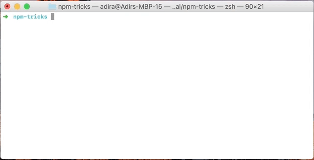

# NPM команды

## Базовые сокращения
Сначала вспомним самые известные сокращения для установки:

- установить пакет: `npm install pkg`, сокращение: `npm i pkg`.
- установить пакет глобально: `npm i --global pkg`, сокращение: `npm i -g pkg`.
- установить пакет только для использования в разработке (devDependency): `npm i --save-dev pkg`, сокращение: `npm i -D pkg`.

Другие сокращения можно посмотреть на официальном сайте.

## Инициализация нового пакета

Первое действие при создании нового пакета — npm init:

  

Если вопросы кажутся вам лишними и вы хотите их проскочить, используйте npm init -y или npm init -f:

 

## Тестирование

Часто используемую команду npm test можно заменить на npm t, она делает то же самое:

  